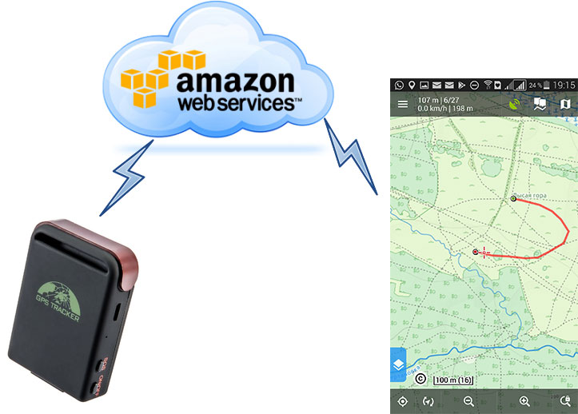

# LocusGpsTracker
Server for monitoring the GPS tracker in the LocusMap

</img>

## Preface
I like RC models, and as soon as I started flying far, especially FPV, I began using the GPS tracker to increase chances of finding the model in case of crash.
Many GPS tracking services are publically available, some are free, but they are typically oriented for vehicle. 
Usially I fly out of roads, so map is blank, interface on the phone screen is not good for me, and stable internet connection required. 
On other hand, for many years I'm using Locus Map Pro (android) for my travels, and I like it a lot.
I wrote to Locus support about possibility to show my custom data on Locus screen and surprisingly almost immediately got the answer how to do it in a simple way (thanks to Jiří M. aka Menion). So I implemented this service and put it to AWS, but any server with Node support can be used.

## How it works
Tracker sends location data via TCP, Locus received data via HTTP GET. One port is used for handling both requests. Data from tracker is saved in the log file, converted to GPX format and sent back to Locus. In case of lost connection, the last position is displayed on the screen along with the track.

## Deploy
Copy
* decoder.js
* gpx-builder.js
* gpx-footer.txt
* gpx-header.txt
* package.json
* server.js
* data

Run
```
node server.js
```

